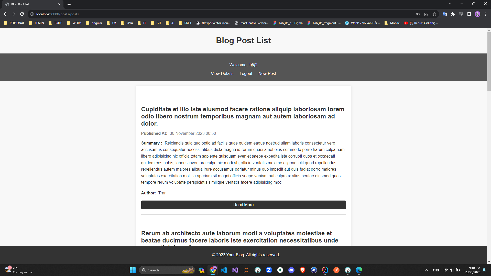

# Blog Web Application - Hướng dẫn sử dụng

## Mô tả Dự Án

Ứng dụng web này được thiết kế để cho phép người dùng đăng bài viết trên Blog và các chức năng cho 1 blog cơ bản. Dưới
đây là mô tả về các đối tượng liên quan đến ứng dụng web của chúng ta.
Tính Năng Chính

1. Quản lý user

   Đăng nhập: cung cấp giao diện để bạn đăng nhập vào blog để có thực hiện các chức năng.

   Thêm User: Cung cấp giao diện cho việc đăng kí một user để tham gia vào blog.

   Chỉnh sửa User: cung cấp giao diện cho việc chỉnh sửa các thông tin của user và cập nhật vào database.

   Đăng xuất: đăng xuất user hiện hành trong phiên làm việc

2. Quản lý Post

   Thêm 1 post: cung cấp giao diện để cho user đăng bài và lưu thông tin vào database.

   Chỉnh sửa 1 post : cung cấp giao diện để cho user của post đó có thể cập nhật lại các thông tin của post.

   Xem 1 post : cung cấp giao diện để bạn có thể đọc được hoàn chỉnh một bài post

   Xem các bài sub post: cung cấp giao diện để có thể đọc được cái sub post của 1 bài post chính.

   Đăng 1 post sub : cung cấp giao diện cho user có thể đăng 1 sub post trong 1 bài post.

3. Quản lý Comment

   Thêm comment: user có thể thêm comment vào 1 post.

   Xem danh sách comment : user có thể xem được danh sách commment của 1 bài post.

   Thêm reply: user có thể reply 1 comment của 1 user khác trong bài post hoặc comment của chính user.

   Xem số lượng reply: có thể xem được số lượng reply của 1 comment

### Mô hình Ứng Dụng

Ứng dụng sử dụng spring boot

* Phần backend chứa các lớp để xử lý
* Phần controller chứa các cotroller để điều khển
* Phần templates chứa các View

## Cài Đặt và Triển Khai

Để chạy web, bạn cần có môi trường sau:

- MariaDB
- Một máy chủ web (ví dụ: Apac Tomcat).
- Môi trường java JDK 17

### Cài đặt MariaDB

1. Tải và cài đặt MariaDB hoặc MySQL từ [https://mariadb.org/download/](https://mariadb.org/download/).

2. Đăng nhập vào MariaDBbằng tài khoản root và tạo một tài khoản với tên "sa" và mật khẩu "sapsword". Sử dụng các lệnh
   SQL sau:
   CREATE USER 'sa'@'localhost' IDENTIFIED BY 'sapsword';
   GRANT ALL PRIVILEGES ON . TO 'sa'@'localhost' WITH GRANT OPTION;
   FLUSH PRIVILEGES.

### Cài đặt Apache Tomcat

1. Đảm bảo bạn đã cài đặt máy chủ ứng dụng servlet như Apache Tomcat trên máy chủ web của bạn.Có thể tại ở
   đây (https://tomcat.apache.org/download-10.cgi)

2. Triển khai mã nguồn của ứng dụng lên máy chủ ứng dụng servlet. Đảm bảo tệp WAR của ứng dụng được đặt trong thư mục
   webapps của Apache Tomcat..Xem hướng
   đẫn (https://www.jetbrains.com/idea/guide/tutorials/working-with-apache-tomcat/using-existing-application/)

### Cài đặt Java 17

1. Cài đặt môi trường java cho ứng dụng (Đề nghị dùng JDK 17),Có thể tải ở
   đây (https://www.oracle.com/java/technologies/javase/jdk17-archive-downloads.html)

2. Setup môi trường java.(https://www3.cs.stonybrook.edu/~amione/CSE114_Course/materials/resources/InstallingJava17.pdf)

### Hướng Dẫn Cài Đặt và Chạy

git clone https://github.com/MinhAn2007/WWW_lab06.git

Cấu Hình Cơ Sở Dữ Liệu:

Mở file application.properties.
Cấu hình thông tin kết nối đến cơ sở dữ liệu phù hợp với cài đặt của bạn.

Mở folder trong IDE hoặc text Editor của bạn(recommend:Intellij)

Chọn file Application trong phần run

Nhấn run ứng dụng. Truy cập URL http://localhost:8080/posts/posts để mở xem các posts
Run file db.script trong folder DB để add dữ liệu test

### Diagram

### Chức năng

Khi truy cập vào URL bạn sẽ truy cập được vào giao diện xem các bài blog

* Web blog khi chưa đăng nhập user

Bạn vẫn chỉ có thể thực hiện các thao tác xem , các thao tác như comment post bài sẽ bị ẩn đi và yêu cầu đăng nhập để có
thể thực hện

Có thể xem cái bài post nhưng không thể post một subpost và comment

Có thể xem các subpost của post đó

Nếu post hoặc subpost không có comment hoặc subpost Trang web sẽ hiện thông báo

Có thể xem các comment của post qua nút View comment nhưng không thể reply

Có thể xem các reply của comment đó

Bạn có thể đăng kí tài khoản qua nút register ở trang chủ

Web sẽ chuyển bạn đến form đăng kí

Sau khi đăng kí thành công user sẽ chuyển bạn đến trang login

* Web blog khi đã đăng nhập user (Email:1@2,MK:qqq)

Sau khi đăng nhập UI sẽ được thay đổi

Bạn có thể xem chi tiết của user qua phần View Details

User có thể update thông tin ở phần update

Sau khi nhập các thông tin và xác nhận. User sẽ được đưa về trang details với các thồng tin đã được cập nhật lại

User có thể đăng bài ở phàn New Post

Sau khi đã điền các thông tin cho bài post và xác nhận bạn sẽ được đưa về trang home với bài post đã được cập nhật

Sau khi bạn đã nhập thì các chức năng post một subpost và comment sẽ được mở

Bạn có thể đăng một subpost ở bài post hiện tại ở phần new sub post

Sau khi đã điền thông tin và xác nhận . Bạn sẽ được đưa về trang details của post , bạn có thể kiểm tra bài subpost vừa
đăng ở phần view subpost

Bạn có thể comment vào bài viết ở nút comment 

Sau khi điền đày đủ và xác nhận . Bạn sẽ được đưa về trang details của post , bạn có thể kiểm tra comment vừa
đăng ở phần view post-comment

Chắc năng reply comment cũng đã được mở . Bạn có thể reply comment 

Sau khi nhập đầy đủ thông tin . Bạn sẽ được đưa tới trang replies của comment bạn vừa add

Số replies của comment đã được cập nhật lên 

* chưa add reply

* đã add 

Đối với bài post không thuộc về user đang đăng nhập, thì chức năng update post sẽ không được hiện ra 

Đối với bài post thuộc về user đang đăng nhập, thì chức năng update post sẽ được hiện ra 

sau khi nhập đầy đủ thông tin và xác nhận bạn sẽ được đưa về details post với thông tin đã được cập nhật 

Khi Logout bạn sẽ được đưa về màn hình đăng nhập 

